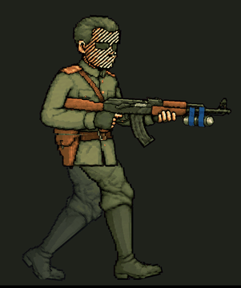
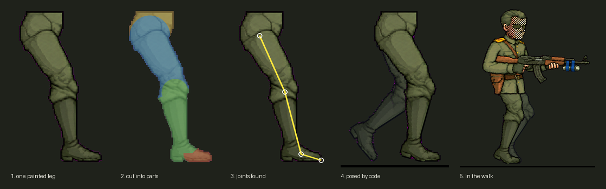

# playable-art

[](https://github.com/Zametki1Cnika/playable-art/actions/workflows/tests.yml)

Turn AI-painted pictures into **playable 2D game art**: paint a part once, let code animate it.

Two tools so far: **rigwalk** — a procedural side-view walk cycle from one painted leg — and **station** — a small
generation station that paints the parts with an image model one at a time, in one style.

Paint (or generate) a single leg once — pelvis, trouser leg, boot — and get a full walk cycle where the
cloth, folds and shading never flicker between frames, because the painting itself never changes:
only its parts move.

| A real character (from the game this tool was built for) | The bundled demo leg |
|---|---|
|  |  |

The commander's legs are a single painted leg walked by code; the torso is a separate painting that rides the pelvis.



## How it works

1. **Find the joints.** `rig.pose()` looks at the leg silhouette: the hip sits on the waist line, the toe is
   the farthest point along the leg, a path runs along the middle of the leg, and the knee and ankle are placed
   on it by proportion.
2. **Cut the leg.** `rig.split_parts()` gives every pixel to the nearest bone (thigh, shin, foot, pelvis).
   Each part keeps a round cap around its joints (radius = half the leg thickness there), the foot does not
   take the boot shaft, and around the knee the thigh fades over the shin — so the knee *bends* instead of
   turning like a disc.
3. **Walk in code.** `walk.LegWalker` moves the feet along paths and finds the knees with two-bone inverse
   kinematics:
   - stance: the foot lies flat and slides back; heel strike pivots around the heel, heel-off around the toe;
   - swing: the foot rises early and travels low; a stiff boot keeps the foot almost in line with the shin;
   - the pelvis is highest over the straight stance leg and lowest with both feet down;
   - the near and the far leg are the same painting, half a cycle apart; the far one is darkened and drawn behind;
   - gaps inside the silhouette are filled from neighbouring pixels, one dark outline goes around it.

## Measured, not eyeballed

`rigwalk.qa.check()` measures every cycle and `pytest` runs it on each push:

- feet never go below the floor (the whole boot, not just the toe point);
- a planted foot does not skate (its slide is a straight line in time);
- knees bend only forward and not past 75°;
- thigh and shin keep their painted length (the pelvis drops when a straight leg could not reach the heel);
- the pelvis bobs, and both steps dip equally (no limp).

## Use

```bash
pip install -r requirements.txt pytest
pytest -q                                     # gait checks
python make_demo_leg.py demo_leg.png          # or use your own leg picture
python -m rigwalk demo_leg.png -o walk_out
```

The leg picture: one leg with the pelvis on top, side view facing right, on a transparent or flat magenta
(`#FF00FF`) background. Output: `walk_00.png …` (RGBA frames), `walk.gif`, `sheet.png` and `joints.json`
(joint positions per frame, handy for attaching a torso, a weapon or a light source).

Tune the gait from the command line (shares of the leg length and degrees):

| option | default | what it does |
|---|---|---|
| `--frames` | 14 | frames per cycle (two steps) |
| `--stride` | 0.80 | stride length |
| `--lift` | 0.066 | how high the swing foot rises |
| `--hip-drop` | 0.042 | pelvis drop with both feet down |
| `--toe-off` / `--heel-strike` | 18 / 13 | foot angles at heel-off and before contact |
| `--ankle-flex` | 12 | max foot-vs-shin angle in the air (stiff boot) |
| `--reach` | 0.98 | how straight the stance leg is |
| `--ms` | 80 | preview frame time |

To keep feet from sliding in a game, play the cycle at the speed it was made for: one cycle covers
`stride / stance` pixels of ground.

## Generation station

`station/` is the production line that feeds the rig: it asks an image model for **one small thing at a time**,
always with references and one shared style, then checks what comes back. It runs on the
[Codex CLI](https://github.com/openai/codex) and its built-in image generation, so a ChatGPT subscription is enough
(no API key).

- **Task folders**: `prompt.txt`, attached `reference*.png`, results in `result/<task>_vN.png`.
- **Chains**: `needs.txt` makes a task wait until another one is accepted (`ACCEPTED.txt`) and attaches its picture:
  etalon -> parts -> frames.
- **One style for everything**: the `## Prompt block` of `STYLE.md` is put in front of every prompt.
- **Pool**: several Codex workers in parallel, `PRIORITY.txt` first; a worker that hits the usage limit rests
  until the time Codex names, a broken worker is benched without losing the task.
- **Automatic checks**: size, flat key background, nothing cut at the edges, not empty.

```bash
python -m station queue examples/tasks          # what is ready to run
python -m station one examples/tasks/001_glowing_mushrooms --root examples/tasks
python -m station run examples/tasks -n 2 --wait
```


*One run of the example task above: the gills are painted flat in one exact colour, so a glow mask can be cut by colour
and the engine adds the light.*

## Roadmap

- [ ] arms and a held weapon on the same rig (aim, recoil, reload)
- [ ] run, idle and turn cycles; transitions between them
- [ ] quadrupeds and many-legged creatures (gaits from foot paths)
- [ ] round-cap-free knee: a second painted leg for deep bends
- [ ] Godot import of the baked sheets with joint data (lights, weapons, effects attached per frame)
- [ ] glow masks and halos from flat emissive colours (`*_glow.png`) as part of the station
- [ ] a review panel for the station (accept / rework / priority in the browser)

## Credits

The approach — AI paints the parts, code makes them move, measured gait with foot paths and IK — follows the ideas
of [ref2game](https://github.com/studioigor/ref2game) by studioigor (MIT). No code was copied from it.

## License

MIT, see [LICENSE](LICENSE).
