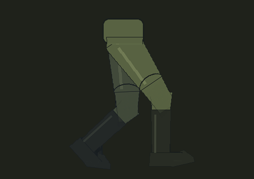

# rig-walk

A procedural side-view walk cycle for 2D games from **one painted leg**.

Paint (or generate) a single leg once — pelvis, trouser leg, boot — and get a full walk cycle where the
cloth, folds and shading never flicker between frames, because the painting itself never changes:
only its parts move.



## How it works

1. **Find the joints.** `rig.pose()` looks at the leg silhouette: the hip sits on the waist line, the toe is
   the farthest point along the leg, a path runs along the middle of the leg, and the knee and ankle are placed
   on it by proportion.
2. **Cut the leg.** `rig.split_parts()` gives every pixel to the nearest bone (thigh, shin, foot, pelvis).
   Each part keeps a round cap around its joints (radius = half the leg thickness there), the foot does not
   take the boot shaft, and around the knee the thigh fades over the shin — so the knee *bends* instead of
   turning like a disc.
3. **Walk in code.** `walk.LegWalker` moves the feet along paths and finds the knees with two-bone inverse
   kinematics:
   - stance: the foot lies flat and slides back; heel strike pivots around the heel, heel-off around the toe;
   - swing: the foot rises early and travels low; a stiff boot keeps the foot almost in line with the shin;
   - the pelvis is highest over the straight stance leg and lowest with both feet down;
   - the near and the far leg are the same painting, half a cycle apart; the far one is darkened and drawn behind;
   - gaps inside the silhouette are filled from neighbouring pixels, one dark outline goes around it.

## Use

```bash
pip install -r requirements.txt
python make_demo_leg.py demo_leg.png          # or use your own leg picture
python -m rigwalk demo_leg.png -o walk_out
```

The leg picture: one leg with the pelvis on top, side view facing right, on a transparent or flat magenta
(`#FF00FF`) background. Output: `walk_00.png …` (RGBA frames), `walk.gif`, `sheet.png` and `joints.json`
(joint positions per frame, handy for attaching a torso, a weapon or a light source).

Tune the gait from the command line (shares of the leg length and degrees):

| option | default | what it does |
|---|---|---|
| `--frames` | 14 | frames per cycle (two steps) |
| `--stride` | 0.80 | stride length |
| `--lift` | 0.066 | how high the swing foot rises |
| `--hip-drop` | 0.042 | pelvis drop with both feet down |
| `--toe-off` / `--heel-strike` | 18 / 13 | foot angles at heel-off and before contact |
| `--ankle-flex` | 12 | max foot-vs-shin angle in the air (stiff boot) |
| `--reach` | 0.98 | how straight the stance leg is |
| `--ms` | 80 | preview frame time |

To keep feet from sliding in a game, play the cycle at the speed it was made for: one cycle covers
`stride / stance` pixels of ground.

## Credits

The approach — AI paints the parts, code makes them move, measured gait with foot paths and IK — follows the ideas
of [ref2game](https://github.com/studioigor/ref2game) by studioigor (MIT). No code was copied from it.

## License

MIT, see [LICENSE](LICENSE).
